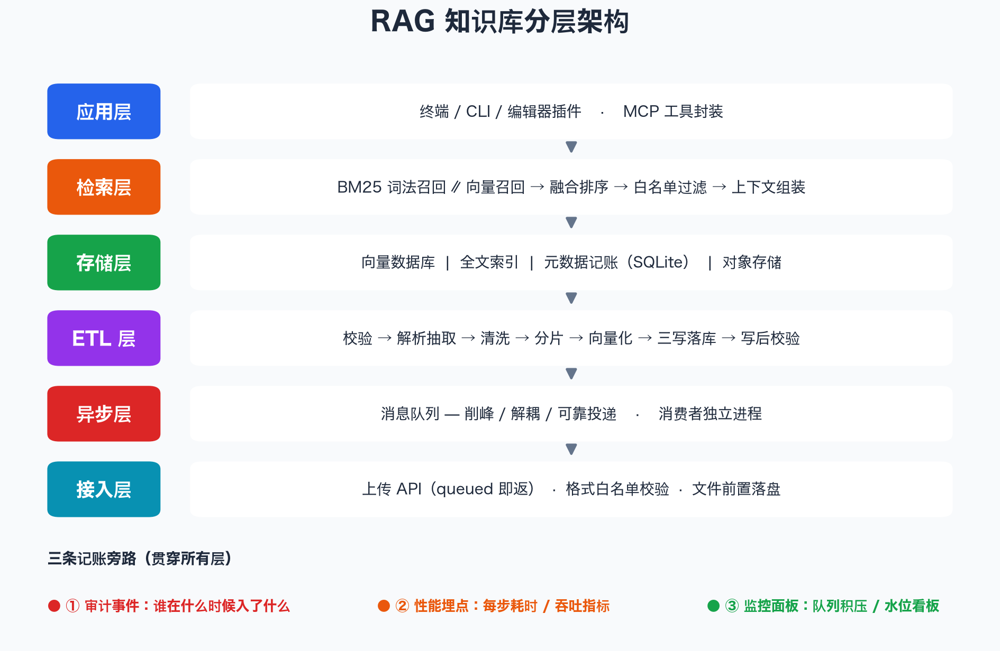
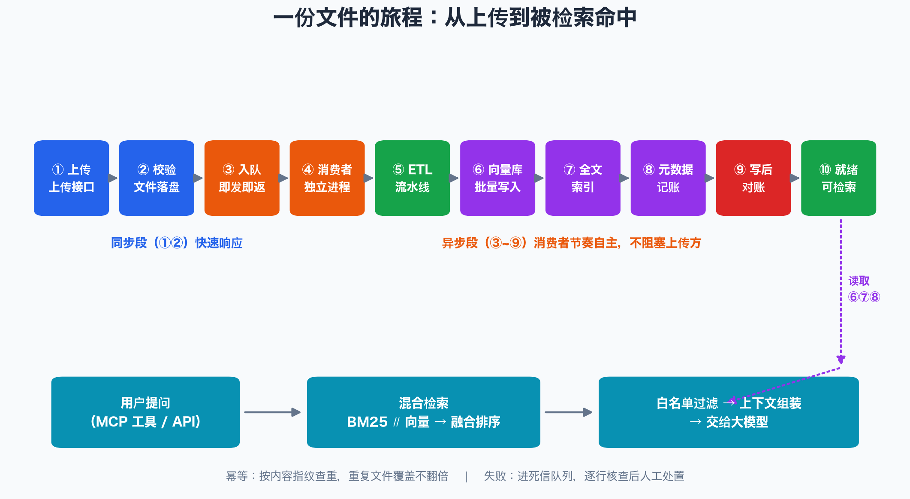
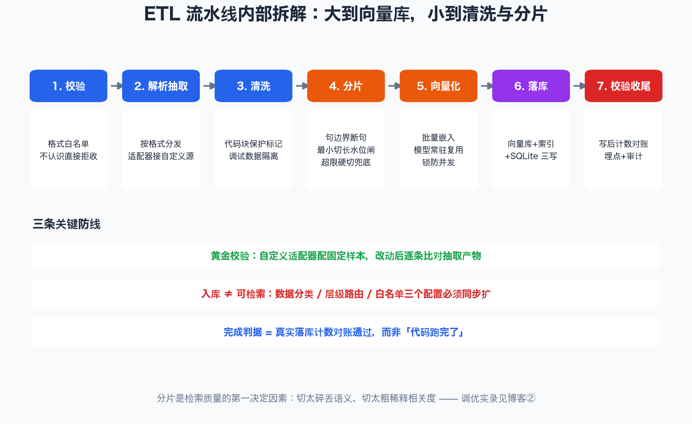

# 从 0 到 1：在本机搭一套生产级 RAG 知识库（一）—— 架构、链路与快速搭建

> 本文是一套完整可运行的开源配套材料的第一篇：所有架构图均为真实生产实践提炼（已做通用化脱敏），文末附一套**零第三方依赖、一条命令跑通**的 mini RAG demo。调优与排查篇见《（二）调优实战》。

---

## 一、先看成果：我们要搭什么

一句话：**让任意一批本地文件（md / txt / json / office 文档），变成可以被自然语言提问、精准回答的知识库**。

完整能力 = 五件事：

1. **接入**：文件上传接口，校验格式、落盘存储，立刻返回"已受理"；
2. **ETL**：后台流水线完成解析、清洗、分片、向量化、多路落库；
3. **存储**：向量数据库 + 全文索引 + 元数据记账，三路各司其职；
4. **检索**：词法与语义双路召回、融合排序、按权限过滤、组装上下文；
5. **观测**：审计、埋点、监控面板三条旁路贯穿始终。

下面这张分层架构图，就是全部组件的地图——先建立全局感，再逐层拆。



---

## 二、整体架构：六个层次 + 三条旁路

### 2.1 六层职责

| 层 | 组件 | 职责 | 选型建议 |
|---|---|---|---|
| 接入层 | 上传 API、格式白名单 | 校验、收文件、投递后即返 | 任意 Web 框架 |
| 异步层 | 消息队列 + 消费者进程 | 削峰、解耦、失败重试 | RabbitMQ / Redis 队列 / 简易 DB 队列 |
| ETL 层 | 解析器、清洗器、分片器、向量化器 | 原始文件 → 可检索的知识块 | 见第四节拆解 |
| 存储层 | 向量库 / 全文索引 / SQLite / 对象存储 | 三写落库 + 原文留存 | LanceDB·Milvus / BM25·ES / SQLite / MinIO·S3 |
| 检索层 | 双路召回 + 融合 + 过滤 + 组装 | 把问题变成上下文 | BM25 ∥ 向量 → RRF 融合 |
| 应用层 | CLI / 插件 / MCP 工具封装 | 人机入口 | 任意对话界面 |

### 2.2 一份文件的旅程

架构图是静态的，数据流是动态的。下面这张图跟踪一份文件从上传到被检索命中的完整旅程——特别注意**同步段**与**异步段**的分界：上传方只等待"校验+落盘"，其余全部交给消费者按自己的节奏消化，这正是"上传不被大文件 ETL 拖死"的关键。



三个容易被忽略的设计点：

- **queued 即返**：接口收到文件、投递消息后立即返回排队号。客户端拿到的是"受理凭证"，不是"完成凭证"；
- **写后对账**：落库完成后用元数据库的计数与预期比对，通过才算就绪。完成判据是真实落库成果，而不是"代码跑完了"；
- **幂等查重**：入库前按内容指纹（MD5）查重，同一文件重复上传覆盖更新、绝不翻倍。

### 2.3 三条旁路：审计、埋点、监控

主链路之外，三条旁路贯穿六层：**审计事件**（谁在什么时候入了什么）、**性能埋点**（每步耗时与吞吐）、**监控面板**（队列积压水位）。它们不影响主流程，但决定系统"出事后能不能说清楚"。本机搭建阶段最少要保留审计——一条 SQLite 追加表的成本，换来的是全部事后排查的依据。

---

## 三、环境准备清单

在本机（macOS / Linux / Windows 均可）搭建，依赖分三档：

**必装（核心链路）**

| 依赖 | 用途 | 本机建议 |
|---|---|---|
| Python ≥ 3.9 | ETL 与检索服务 | 3.10+ |
| SQLite | 元数据记账（系统自带） | — |
| 向量库 | 语义检索 | 单机首选嵌入式（如 LanceDB），免部署 |
| Embedding 模型 | 文本向量化 | 本机用 CPU/Apple MPS 可跑 bge-m3 级别小模型 |

**按规模加装**

| 依赖 | 什么时候需要 | 替代方案 |
|---|---|---|
| 消息队列 | 文件量大、需要削峰与失败重试 | SQLite 当简易队列起步 |
| 对象存储 | 原始文件需要独立留存 | 本地目录起步 |
| 监控面板 | 多人使用 / 生产化 | 审计表 + 脚本巡检 |

**两条经验**

- Embedding 模型**常驻复用**：模型加载一次、进程内反复调用。每个请求重新加载模型是本机实践里 CPU 打满的头号原因；
- 向量化与写入**加锁串行化**：embedding 与落库各自一把进程锁，避免并发写坏索引。

---

## 四、ETL 流水线内部拆解：大到向量库，小到清洗与分片

这是搭建中最值得花时间的部分。七个环节，每个都有"防线"：



### 4.1 校验：格式白名单，不认识直接拒收

维护一张格式白名单（如 `txt / md / json / docx / xlsx / csv / pptx / html`），不在名单内的文件在入口直接拒收并给出明确报错，而不是流入流水线深处才莫名失败。白名单是**契约**——要支持新格式，走一次正式变更，不要随手放行。

### 4.2 解析与抽取：通用解析器 + 合同化适配器

- 常规格式交给通用解析器；
- 自定义源格式（如会话日志、注册表 JSON）写**专门的适配器**，登记进解析契约，并给每个适配器配**黄金样本**：同一输入的抽取产物逐条比对，改动适配器后跑一遍，防止"解析静默变味"。

血的教训（通用化转述）：直接把源码文件丢给通用解析器，会丢失代码块结构、生成检索层根本不认识的字段——**入库成功但检索隐身**。适配器的价值就是把"格式差异"挡在流水线最前面。

### 4.3 清洗：代码块保护 + 调试数据隔离

两条铁律：规则类文档里的代码块必须加保护标记原样保留（通用清洗会把缩进和空行压坏）；调试态数据必须清晰标记、永不穿透到正式库。

### 4.4 分片：检索质量的第一决定因素

切太碎丢语义、切太粗稀释相关度。生产验证过的三层切分策略：

1. **句边界断句**：只在句末标点、换行处下刀，切点 100% 落在句边界；
2. **最小切长水位闸**：累积段落超过阈值（实践中 26 字符）才允许在分隔符处切，不足则并段继续累积；文档收尾不足的尾段强制并回前一块——这一步把碎片率从 13.4% 降到 0%；
3. **超限硬切兜底**：单块超过上限强制切，保证没有超长块。

> 完整的标定方法（怎么科学地选出 26 这个数）和配对实测数据，是第二篇博客的主角。

### 4.5 向量化：批量 + 常驻 + 锁

批量提交、模型常驻、双锁串行。三个词展开就是：攒一批一起算、模型只加载一次、进程锁防并发写。

### 4.6 落库：三写一体 + 写后对账

一个知识块要写三处：**向量库**（语义）、**全文索引**（词法）、**元数据库**（记账）。三者是一个事务语义上的整体——先原子完成三写，再做异步的记账补充。收尾必须做**写后计数对账**：元数据库的权威计数与预期一致，这个文件才算"就绪"。

### 4.7 幂等与失败

- 幂等：内容指纹查重，重复文件覆盖不翻倍；
- 失败：进死信/待查队列，消费者空闲时逐行核查——文档在库健康的删失败行、真缺失的保留并告警，等人工处置。

---

## 五、检索链路：双路召回到上下文组装

检索不是"查一下"一个动作，而是四步流水：

1. **双路召回**：BM25 词法召回（关键词精确命中）∥ 向量召回（语义近似），各取 Top-K；
2. **融合排序**：Reciprocal Rank Fusion（`score = Σ 1/(k+rank)`）把两路排名融合，无需调两套分数权重；
3. **权限过滤**：按角色白名单过滤可见数据——这就是"入库 ≠ 可检索"的最后一道闸；
4. **上下文组装**：把命中块拼装成大模型可用的上下文。**上下文拼接本身就是召回质量的一部分**（顺序、去重、截断都有讲究），评估检索质量必须读到出参组装层，不能只看检索函数。

四层数据模型（会话记录 / 技能文档 / 业务资料 / 配置文档）通过"数据分类 → 层级路由 → 角色白名单"三个配置联动。**新增一种数据分类，三个配置必须同步扩**，否则就是静默隐身。

---

## 六、动手跑通：一条命令的 mini RAG

本仓库 `demo/` 目录是一套**零第三方依赖**（纯 Python 标准库）的迷你实现，麻雀虽小五脏俱全：格式白名单、清洗、句边界+水位闸分片、哈希投影向量化、纯 Python BM25、RRF 融合、写后对账、MD5 幂等，全部对应上文架构。

```bash
git clone <本仓库地址>
cd dsh-skills/demo
bash start.sh            # 一键：环境检查 → 批量入库+对账 → 检索冒烟
```

典型输出（截取）：

```
== 批量入库：一次性入队 3 个文件 ==
  [入库] chunking_notes.md: 7 块
== 对账：chunks 权威计数 26 / 预期 26 | 文档 3 个就绪 ==
对账通过 ✓（BM25 索引已重建）

──── 查询「分片 参数 怎么调」
  融合 Top3: ['2375f3a6:6', '6f22b50a:0', '2375f3a6:4']
[1] 所有分片参数必须回写配置真源文件。临时调参等于负债...
```

想验证分片水位闸的作用：改 `config.py` 里的 `MIN_CHUNK = 5` 再 `bash start.sh --rebuild`，对比分块数量与检索命中质量。参数全部集中在 `config.py`（参数唯一真源），体验"改参数 → 看效果"的调优闭环。

---

## 七、十分钟搭建路线图（本机版）

1. **装环境**（2 分钟）：Python + 嵌入式向量库 + embedding 模型；
2. **起服务**（2 分钟）：上传 API + 消费者进程（demo 里 `start.sh` 一并拉起）；
3. **配契约**（3 分钟）：格式白名单、数据分类/层级路由/角色白名单三件套、分片参数；
4. **灌数据**（1 分钟）：批量上传，看对账通过、水位归零；
5. **验检索**（2 分钟）：带分类过滤做冒烟检索，确认"入库且可检索"。

每一步的"完成判据"都是机械可查的：服务有健康检查、入库有计数对账、检索有冒烟命中。**不带对账的搭建，等于没有搭建。**

---

## 八、下一篇预告

搭建只是起点，真实系统马上会遇到：碎片化切分拖垮检索质量、"入库成功但检索隐身"的静默故障、绕过队列直连入库导致监控失明、队列积压无人治理……《（二）调优实战》用六个真实案例讲透：**遇到什么问题 → 怎么排查 → 根因是什么 → 参数怎么调 → 实测收益多少**。

---

*本文配套代码与架构图均在本仓库：`demo/`（可运行 mini RAG）、`assets/`（架构图源码，`python3 assets/make_diagrams.py` 可重新生成）。内容源自真实生产实践的通用化脱敏版本。*
