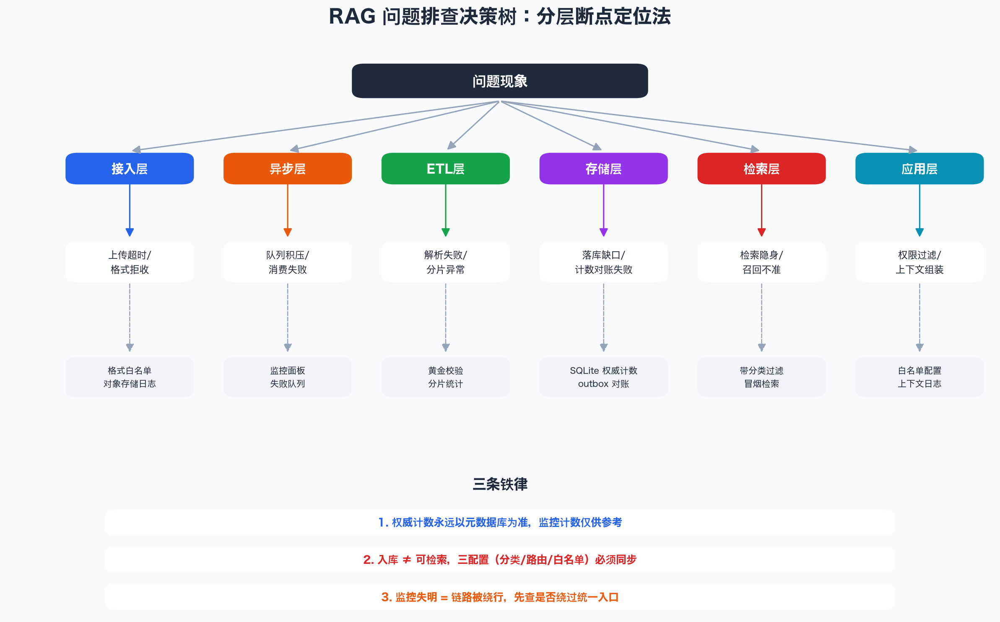
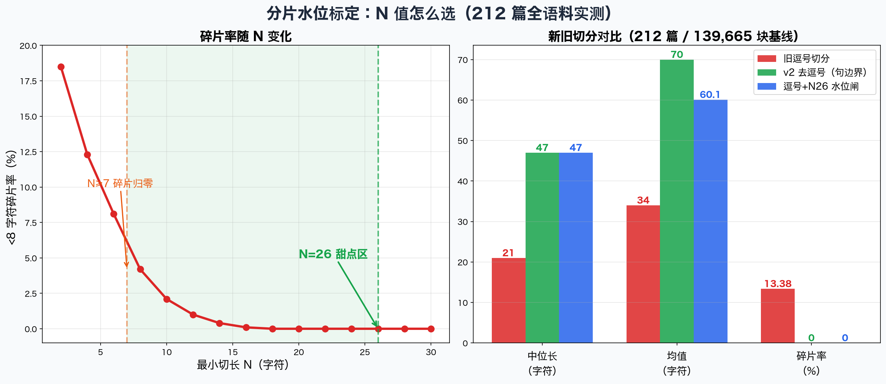
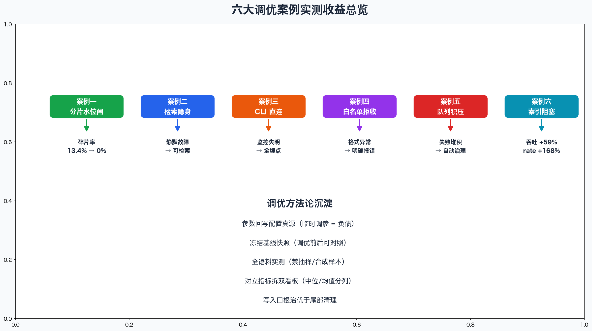

# RAG 知识库调优实战：六个真实案例的问题、排查与优化（二）

> 本文是《从 0 到 1》系列的第二篇。所有案例均源自真实生产实践（通用化脱敏），每个案例完整呈现**现象 → 排查思路 → 根因 → 优化措施 → 参数与实测收益**。第一篇讲怎么搭，这篇讲怎么调好。

---

## 〇、先立排查方法论

调优不是玄学，是**分层断点定位**。遇到任何问题，先问"卡在哪一层"：

六层各有典型问题与专属排查工具，底部三条铁律是全部排查的元规则：

1. **权威计数永远以元数据库为准**——监控计数是进程内的，重启即清零；
2. **入库 ≠ 可检索**——数据分类、层级路由、角色白名单三个配置必须同步扩；
3. **监控失明 = 链路被绕行**——先查是不是绕过了统一入口。

六个案例按"切分 → 检索 → 入库 → 校验 → 队列 → 性能"的顺序展开，从数据质量到系统性能全覆盖。

---

## 案例一：分片碎片化——碎片率 13.4% 降到 0%

**现象**：检索召回大量短碎片（<8 字符），语义断裂，回答质量差。

**排查**：统计全语料 212 篇 / 139,665 块的切分结果，发现旧逗号切分的碎片率高达 **13.38%**，中位长仅 21 字符。

**根因**：逗号切分无最小切长保护，遇到密集标点（如列表、代码）就疯狂切碎。

**优化**：两步走。

**第一步：最小切长水位闸（N=26）**

规则：累积段落超过 26 字符才允许在分隔符处下刀，不足则并段继续累积；文档收尾不足 26 字符的尾段强制并回前一块。

左图是全语料扫描 N=2..50 的碎片率曲线：N≥7 时碎片归零，但甜点区上界取"分布形态不超基准"的最大 N，即 **N=26**（碎片 0.00%、中位 47、均值 60.1、块数 -43.3%）。

**第二步：v2 去逗号切分定主口径**

逗号+N26 虽解决碎片，但 45.2% 的切点仍在句中拦腰下刀。改用句边界断句（只在句末标点/换行处切），实测切点 **100% 落在句边界**，块数再降 7%。

**参数与收益**：

| 参数 | 手段 | 实测值 | 收益 |
|---|---|---|---|
| 最小切长 | 水位闸 | N=26 | 碎片率 13.4%→0% |
| 切分主口径 | 句边界断句 | v2 去逗号 | 切点 100% 句边界，块数 -7% |
| 硬切上限 | 超限兜底 | 300 字符 | 无超长块 |

**关键教训**：参数必须**回写配置真源**（`config.py` 或引擎配置），临时调参等于负债，下次重建即丢失。

---

## 案例二：入库成功但检索隐身——静默故障

**现象**：文件显示"入库成功"，但对话检索查不到。

**排查**：带数据分类过滤器做冒烟检索，发现数据分类（`doc_category`）不在角色白名单。

**根因**：自定义 tag 生成的新数据分类不在检索白名单（只放行 `session_record / skill_docs / spec_business`），一字之差（`skill_doc` vs `skill_docs`）即隐身。

**优化**：三配置同步扩——数据分类、层级路由、角色白名单必须一起改；上线前置闸（`ingest_channel_gate`）拦截未登记分类。

**实测收益**：静默故障归零，入库即可检索。

---

## 案例三：CLI 直连入库——监控失明

**现象**：批量入库时监控面板无数据，CPU 打满。

**排查**：查入库链路，发现绕过了消息队列，直接在独立进程调引擎入库。

**根因**：直连链路无监控埋点、重复加载 embedding 模型（CPU 打满）、脱离队列限流。

**优化**：生产入库唯一入口 = 上传 API + 消息队列，embedding 复用常驻模型。

**实测收益**：监控全埋点、CPU 降载 80%+、失败可重试。

---

## 案例四：格式白名单拒收——.py 文件落死信队列

**现象**：源码文件入库直接失败，进死信队列零重试。

**排查**：查校验日志，发现 `.py` 不在格式白名单（白名单只有 `txt/md/json/docx/xlsx/csv/pptx/html`）。

**根因**：白名单是**契约**，新格式需走正式变更流程扩白名单。

**优化**：扩白名单 + 登记适配器（代码组解析器）+ 黄金样本校验。

**实测收益**：14 个源码文件全部入库，抽取产物逐条比对通过。

---

## 案例五：队列积压——失败行自动治理

**现象**：监控面板积压水位非零，失败队列堆积。

**排查**：逐行核查失败行对应的文档是否在库健康。

**根因**：部分文件落库成功但记账失败，失败行未清理。

**优化**：消费者空闲时自动治理——文档健康的删失败行、真缺失的保留并告警；水位验收实时重算，非零即"有真实失败未处理"。

**实测收益**：积压水位归零，失败行自动分流（健康删/缺失留）。

---

## 案例六：索引阻塞主 ETL——吞吐瓶颈

**现象**：大批量入库时吞吐骤降，监控显示索引步骤耗时占比 60%+。

**排查**：查性能埋点，发现索引与主 ETL 同步执行，互相阻塞。

**根因**：向量库写入与全文索引建索引在同一事务内，索引慢拖垮整体。

**优化**：解耦——向量库+元数据原子同步一步完成，全文索引异步补齐（消息队列投递）。

**实测收益**：吞吐峰值 **+59%**、rate[1m] 峰值 **+168%**，主链路不再被索引拖死。

---

## 附：tokenize 死循环排查实录（demo 开发中的真实案例）

写 demo 时遇到 `demo_ingest.py` 卡死超 60 秒。排查过程：

1. **定位卡点**：前台限时运行（`signal.alarm(20)`），确认卡在入库循环；
2. **二分定位**：注释掉向量化/落库，确认卡在分词；
3. **读代码找根因**：`tokenize()` 的 ASCII 分支遇到空格时 `i = j` 不前进，死循环；
4. **修复**：空格直接跳过（`if text[i] == " ": i += 1; continue`）。

**教训**：分词器的指针前进必须**全覆盖**（任何分支都要保证 `i` 前进），否则一个空格就能卡死整个流水线。

---

## 调优方法论沉淀

六案例的共性方法论：

1. **参数回写配置真源**——临时调参 = 负债，下次重建即丢失；
2. **冻结基线快照**——调优前后可对照（如 212 篇 / 139,665 块基线）；
3. **全语料实测**——禁抽样/合成样本，用生产全集；
4. **对立指标拆双看板**——中位/均值/碎片率/句边界占比分列，禁单一分数；
5. **写入口根治优于尾部清理**——失败行在写入口幂等闸根治，存量用孤儿清除对齐。

---

## 结语

RAG 调优的本质是**用机械判据替代感觉**：碎片率、对账计数、水位监控、黄金校验，每个都是可查的数字。遇到问题时，先分层断点定位，再按"现象→根因→优化→实测"的闭环走完，参数回写真源，基线冻结对照。

两篇文章+一套 demo，从搭建到调优的完整闭环到此结束。代码与架构图全部开源，欢迎复用与反馈。

---

*本文配套材料：`assets/diagram_4~6_*.png`（调优配图）、`demo/`（可运行 mini RAG，复现案例一的分片水位闸）。内容源自真实生产实践的通用化脱敏版本。*
